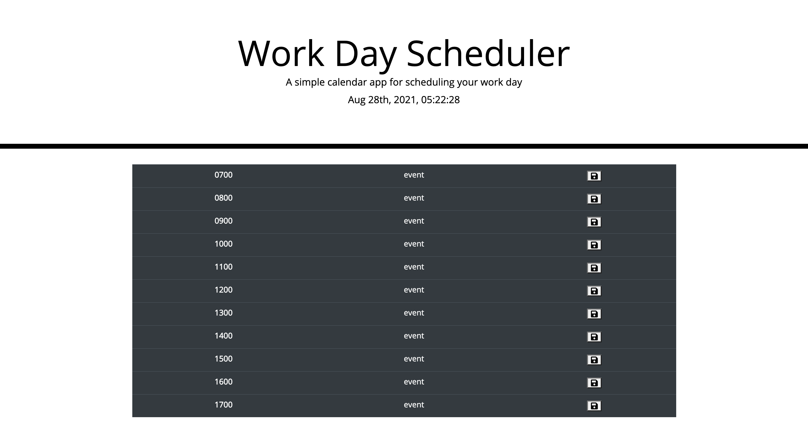

# Daily Planner
by Eduard Voicu

## User Story
```
AS a USER, I want to BE able to input HOURLY plans in an event planner.
AS a USER, I SHOULD be able to save my entries for future reference.

```
```
AS a DEVELOPER, I have created a daily planner application that allows the USER
to see the current time and date. USER is able to input entries into special time blocks between 0700 (7AM) and 1700 (5PM) and save it
on the personal computer local storage in order to come back and reference it. The planner also allows the user to what time block is within the current hour and what time blocks are considered in the past.
```

## Screenshot of Deployed App


## Links
[GitHub Deployed App Link](https://eduardvoicu.github.io/daily-planner/)
[GitHub Repo](https://github.com/eduardvoicu/daily-planner)